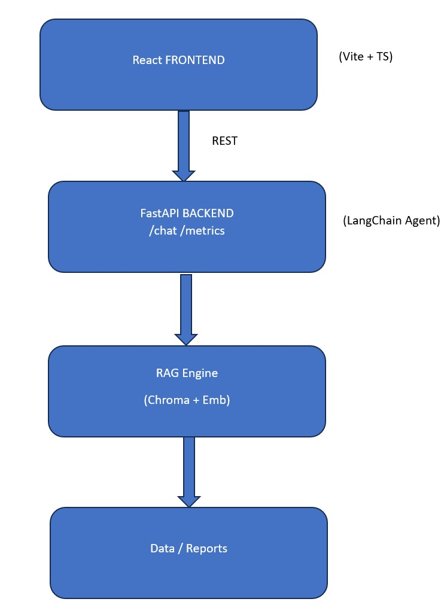

# Agent ONE — Unified AI Agent Platform

**Agent ONE** is a full-stack, containerized AI-Agent framework built by **Raghavendra S.** to demonstrate real-world *Agentic AI + MLOps + DevOps fusion*.  
It combines **LangChain**, **FastAPI**, **React (Vite + TS)**, and **Prometheus-based observability** — everything a modern AI engineer needs to build, deploy, and monitor intelligent agents.

---

## Why Agent ONE?

Traditional GenAI demos stop at chat UIs.  
Agent ONE goes further — it’s *production-grade*: modular, observable, and cloud-ready.  
Designed for **enterprise reporting and automation use-cases**, it can:

- **Query** structured/unstructured data via Retrieval-Augmented Generation (RAG)  
- **Summarize** and explain reports using domain-specific context  
- **Integrate tools** for analytics, visualization, or decision support  
- **Log metrics** for latency, token cost, and call frequency  
- **Scale** easily on Kubernetes or serverless backends  

---

## Tech Stack Overview

| Layer | Tech | Purpose |
|-------|------|----------|
| **Frontend (UI)** | React + TypeScript + Vite | Chat interface & visualization |
| **Backend (API)** | FastAPI | LLM routing, tool orchestration |
| **AI Framework** | LangChain + HuggingFace + OpenAI | Agent reasoning & embeddings |
| **Data Store** | ChromaDB (persistent vector store) | RAG retrieval layer |
| **Monitoring** | Prometheus + Grafana-ready metrics | Latency, request count, tokens |
| **Infra/DevOps** | Docker, Makefile, K8s manifests | Local-to-cloud portability |
| **CI/CD** | GitHub Actions (under `ops/github-actions/`) | Build, lint, deploy automation |

---

## Architecture at a Glance



*Agent ONE connects the UI → API → Agent (LangChain) → Vector Store, all instrumented with Prometheus for metrics.*

---

## Setup and Run (Local Dev)

> Requires: **Python ≥3.12**, **Node ≥18**, **Docker**, **Make**, and optionally **OpenAI API Key**.

```bash
# clone
git clone https://github.com/coolhead/agent-one.git && cd agent-one

## 1️ API Setup
cd apps/api
python -m venv .venv && source .venv/bin/activate
pip install -r requirements.txt
cp .env.example .env
# Add your OpenAI key in .env
make api

## 2 UI Setup (in a new terminal)
cd ../ui
npm install
npm run dev -- --host 0.0.0.0 --port 8501

## 3 Visit
Frontend → http://localhost:8501  
Backend Docs → http://localhost:8000/docs


RAG Data Ingestion

Add business or report data under data/:

data/
├── fin_q3_summary.txt
├── dxc_vision.md
└── sales_report_snippet.md


Then run:

make ingest


This vectorizes and persists documents in .chroma/.

## Real-World Use Case: AI-Driven Reporting Assistant

Agent ONE can read domain-specific reports and answer questions like:

“Summarize Q3 performance trends and highlight risks.”
“Generate customer insights from APAC sales reports.”

This demonstrates how enterprises can embed GenAI agents into business intelligence dashboards, ETL pipelines, or customer-facing portals.

---
## Observability and Metrics

Accessible at http://localhost:8000/metrics

Exposes Prometheus-compatible metrics:

agent_requests_total

agent_latency_seconds

agent_tool_calls_total

agent_token_estimate

These can be scraped by Prometheus or visualized in Grafana dashboards.

---
## Cloud & Container Deployment
Build and run locally
make docker-build
make docker-run

---
## Kubernetes Deployment (under infra/k8s/)

Includes manifests for:

API Deployment + Service

UI Deployment + Service

ConfigMap for env vars

HPA (HorizontalPodAutoscaler)

Deploy via:

kubectl apply -k infra/k8s/

---
##  Developer Utilities
Command	Description
make api	Run FastAPI backend
make ui	Launch Vite UI
make ingest	Index docs into vector DB
make test	Run unit tests
make docker-*	Build / run Docker images
make clean	Remove caches & temp dirs

---
## Guardrails and Safety

Regex-based PII redaction before responses

Optional profanity & prompt-injection filters

Easy extension point for LangGraph guardrails

---
Author:

Raghavendra S. 
DevOps | MLOps | Agentic AI Engineer

📍 Bengaluru, India, 🔗 GitHub  · LinkedIn
